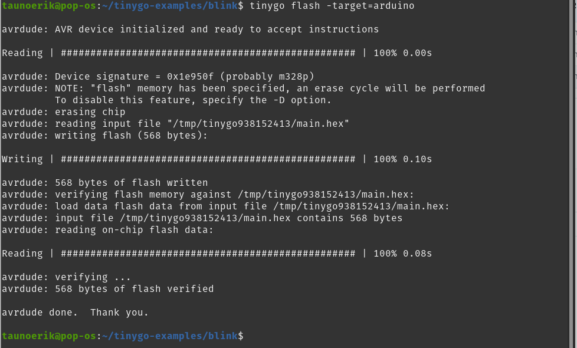

# Blink

Uploading to Arduino Uno:

    tinygo flash -target=arduino

Specifiying the port if needed

    tinygo flash -target=arduino -port=/dev/ttyACM0

## uf2

    tinygo build -o=/media/[USERNAME]/[NAME OF THE BOARD]/flash.uf2 -target=circuitplay-express examples/blinky1

 ___

Copyright Tauno Erik 2021 [taunoerik.art](https://taunoerik.art/)